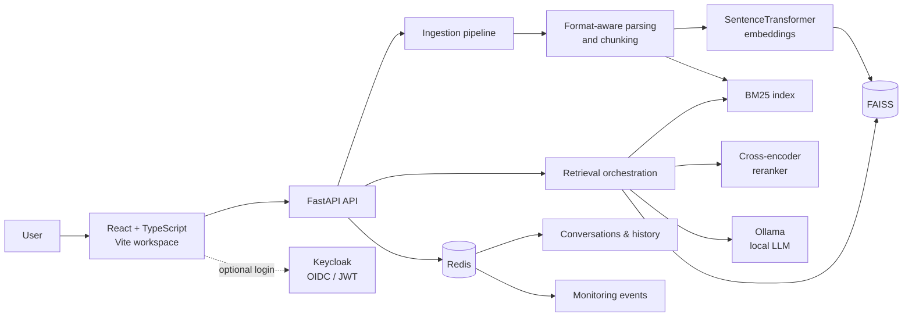

# Askwise — Production-Minded RAG Workspace

> A full-stack, multi-tenant Retrieval-Augmented Generation (RAG) application for asking reliable questions over private documents and structured data.

Askwise goes beyond a basic “chat with PDF” demo. It combines semantic and keyword retrieval, cross-encoder reranking, tenant-scoped access control, conversation memory, CSV-aware analytics, and built-in quality/latency monitoring in a polished React workspace.

## Why this project stands out

| Capability | What it demonstrates |
| --- | --- |
| **Hybrid retrieval** | FAISS vector search + BM25 keyword search, score fusion, and optional cross-encoder reranking for more relevant context. |
| **Grounded answers** | Local Ollama generation is explicitly constrained to retrieved document context, with source chunks returned to the UI. |
| **Structured-data intelligence** | CSV rows remain intact and support exact lookups, comparisons, counts, averages, sums, min/max, missing-value checks, and grouped aggregations. |
| **Multi-tenant by design** | Tenant IDs travel through ingestion, vector search, BM25, documents, conversations, and structured-data operations. |
| **Real authorization** | Optional Keycloak OIDC/JWT integration with `admin`, `user`, and `viewer` role controls. |
| **Operational visibility** | Redis-backed query logs, latency statistics, error metrics, and heuristic grounding/hallucination signals are exposed through an API and dashboard. |
| **Production-minded UX** | Document library, re-indexing, persistent conversations, source-aware results, responsive React UI, and Dockerized local deployment. |

## Product walkthrough

1. Upload PDFs, DOCX, CSV, Markdown, HTML, XML, source code, or plain-text files.
2. Ask a question in **Hybrid**, **Vector**, or **Keyword** search mode.
3. Inspect the answer alongside its retrieved source chunks and continue the conversation.
4. Switch to the document library to review, re-index, or delete tenant-scoped documents.
5. Use the monitoring view to inspect query activity, latency, errors, and grounding flags.

For CSVs, Askwise can answer questions such as:

```text
What is the average salary for Engineering employees?
Count active customers in Bengaluru.
Show total revenue by region.
Which orders have an amount greater than 10,000?
```

## Architecture



### Retrieval lifecycle

```text
Question → tenant scope → vector + BM25 candidate retrieval
         → normalized weighted fusion (or RRF) → cross-encoder reranking
         → grounded Ollama prompt → answer + sources + telemetry
```

The default hybrid strategy weights semantic vector relevance at **0.7** and lexical relevance at **0.3**, then reranks up to **20** candidates with `cross-encoder/ms-marco-MiniLM-L6-v2`. If the reranker or Ollama is unavailable, the application degrades safely: fused retrieval remains available and a context-based fallback answer is returned.

## Feature set

### Intelligent document ingestion

- PDF extraction with `pdfplumber` and `pypdf` fallback; table-aware parent/child chunks
- DOCX, CSV, code, Markdown, HTML, XML, and plaintext support
- Recursive text splitting with overlap; structural/language-aware splitters for formatted content and source code
- Row-preserving CSV ingestion with normalized field metadata for deterministic answers
- Persisted FAISS index and document metadata
- Tenant-scoped source retention and one-click document re-indexing

### Search, generation, and trust

- `vector`, `keyword`, and `hybrid` retrieval modes
- FAISS semantic search using `sentence-transformers/all-MiniLM-L6-v2` embeddings
- BM25 lexical search and normalized weighted fusion / reciprocal-rank fusion
- Lazy-loaded local cross-encoder reranking
- Context-only prompt construction and source-file attribution
- Exact structured-record matching before semantic retrieval when appropriate

### Secure multi-user foundation

- Keycloak JWT validation and optional authentication switch (`AUTH_ENABLED`)
- Role-based permissions: **admin** (ingest/delete), **user** (query/history), **viewer** (document read)
- Tenant isolation applied to metadata, searches, document operations, CSV calculations, and conversations
- Tenant-safe filename deletion that avoids information leakage across workspaces

### User experience and observability

- React chat workspace with conversation creation, title updates, history, and deletion
- Document library with chunk/page metadata, re-indexing, and deletion controls
- Result cards with search-mode selection and retrieved context
- Redis-backed monitoring: query logs, timings, errors, rolling latency stats, and grounding flags
- Monitoring dashboard plus FastAPI interactive documentation

## Tech stack

| Layer | Technologies |
| --- | --- |
| Frontend | React 18, TypeScript, Vite, Axios, React Markdown, Keycloak JS |
| API | Python 3.12+, FastAPI, Pydantic, Uvicorn |
| Retrieval | FAISS, Sentence Transformers, BM25, CrossEncoder, NumPy |
| Generation | Ollama (`llama3.2:1b` by default) |
| Data & state | Redis, persisted FAISS metadata |
| Identity | Keycloak, OIDC, JWT, RBAC |
| DevOps | Docker Compose, Docker, pytest, uv |

## Quick start

### Prerequisites

- Docker and Docker Compose
- At least 8 GB RAM is recommended for local embedding/reranking models

### Run the complete stack

```bash
git clone <your-repository-url>
cd rag-system
docker compose up --build
```

Then open:

| Service | URL |
| --- | --- |
| Askwise UI | [http://localhost:3000](http://localhost:3000) |
| FastAPI docs | [http://localhost:8000/docs](http://localhost:8000/docs) |
| Health endpoint | [http://localhost:8000/api/health/health](http://localhost:8000/api/health/health) |
| Keycloak admin console | [http://localhost:8080](http://localhost:8080) |
| Ollama (host mapping) | `http://localhost:11435` |

The first model-based request may take longer while local model artifacts are downloaded/initialized.

### Local development

Run the API:

```bash
cd backend
uv sync
uv run uvicorn src.main:app --reload --host 0.0.0.0 --port 8000
```

Run the frontend in a second terminal:

```bash
cd frontend
npm install
npm run dev
```

Ensure Redis and Ollama are available locally. The default frontend API base URL is `http://localhost:8000/api`.

## Configuration

The backend reads environment variables from `backend/.env` (or process environment). Common settings:

| Variable | Default | Purpose |
| --- | --- | --- |
| `REDIS_URL` | `redis://localhost:6379/0` | Primary Redis database |
| `FAISS_INDEX_PATH` | `./faiss_index` | Persisted vector index location |
| `EMBEDDING_MODEL` | `sentence-transformers/all-MiniLM-L6-v2` | Embedding model |
| `RERANKER_ENABLED` | `true` | Enables cross-encoder reranking |
| `RERANKER_MODEL` | `cross-encoder/ms-marco-MiniLM-L6-v2` | Reranker model |
| `RERANKER_CANDIDATE_COUNT` | `20` | Maximum fused candidates to score |
| `OLLAMA_URL` | `http://localhost:11434` | Ollama API endpoint |
| `OLLAMA_MODEL` | `llama3.2:1b` | Local generation model |
| `AUTH_ENABLED` | `false` | Turns on Keycloak JWT and RBAC enforcement |
| `KEYCLOAK_URL` | `http://localhost:8080` | Identity provider URL |

For the frontend, set `VITE_API_URL` to an API base URL that includes `/api`, for example `http://localhost:8000/api`.

## API at a glance

| Area | Endpoints |
| --- | --- |
| Health | `GET /api/health/health` |
| Documents | `POST /api/documents/upload`, `GET /api/documents/list`, `POST /api/documents/reindex/{file_name}`, `DELETE /api/documents/{file_name}` |
| RAG | `POST /api/query` |
| Conversations | `GET/POST /api/query/conversations`, `GET/PUT/DELETE /api/query/conversations/{id}` |
| History | `GET/DELETE /api/query/history` |
| Auth | `GET /api/auth/status`, `GET /api/auth/me` |
| Monitoring | `GET /api/monitoring/metrics`, `/queries`, `/errors`, `/hallucinations`, `/latency/{operation}` |

Example query:

```bash
curl -X POST http://localhost:8000/api/query \
  -H 'Content-Type: application/json' \
  -d '{
    "query": "What are the main risks described in the uploaded report?",
    "search_method": "hybrid",
    "top_k": 5
  }'
```

## Testing and verification

```bash
cd backend
pytest
python verify_setup.py
```

The test suite covers API behavior, retrieval and reranking behavior, service flows, task plumbing, and CSV structured-record scenarios.

## Repository structure

```text
.
├── backend/
│   ├── src/api/routes/       # FastAPI route handlers
│   ├── src/core/             # Configuration, auth, tenant isolation
│   ├── src/services/         # Ingestion, retrieval, generation, monitoring
│   ├── src/db/               # FAISS and Redis adapters
│   ├── src/utils/            # Parsers, routing, chunkers, retry helpers
│   └── tests/                # Backend test suite
├── frontend/src/
│   ├── components/           # Chat, documents, conversations, monitoring
│   ├── context/              # Authentication state
│   └── services/             # API client
├── docker-compose.yml        # Local multi-service environment
└── PROJECT_TECHNICAL_WORKFLOW.md
```

## Design decisions worth discussing in an interview

- **Why hybrid retrieval?** Dense retrieval handles semantic similarity; BM25 retains exact terminology and identifiers. Combining them improves recall across document types.
- **Why rerank after fusion?** A cross-encoder sees the query and candidate together, giving a more precise final ordering without applying its higher cost to the entire corpus.
- **Why preserve CSV rows?** Embedding arbitrary slices of a table makes exact math and filters unreliable. Keeping rows intact allows deterministic analytics alongside semantic search.
- **Why enforce tenancy at every layer?** Filtering only the UI or API route is insufficient. The tenant constraint is part of document metadata and every retrieval/state operation.
- **Why local models?** Ollama and open-source retrieval models allow private, offline-friendly document workflows and make the system easy to demo without paid API credentials.

## Future directions

- Background ingestion with durable job status and progress events
- Evaluation datasets with retrieval and grounded-answer quality metrics
- Object storage and managed Redis/vector infrastructure for cloud deployment
- Streaming responses and token-level citations
- Fine-grained document ACLs and audit trails

---

Built as a portfolio project to demonstrate applied LLM engineering, information retrieval, secure multi-tenant backend design, and product-focused frontend development. See [PROJECT_TECHNICAL_WORKFLOW.md](PROJECT_TECHNICAL_WORKFLOW.md) for the detailed technical workflow.
